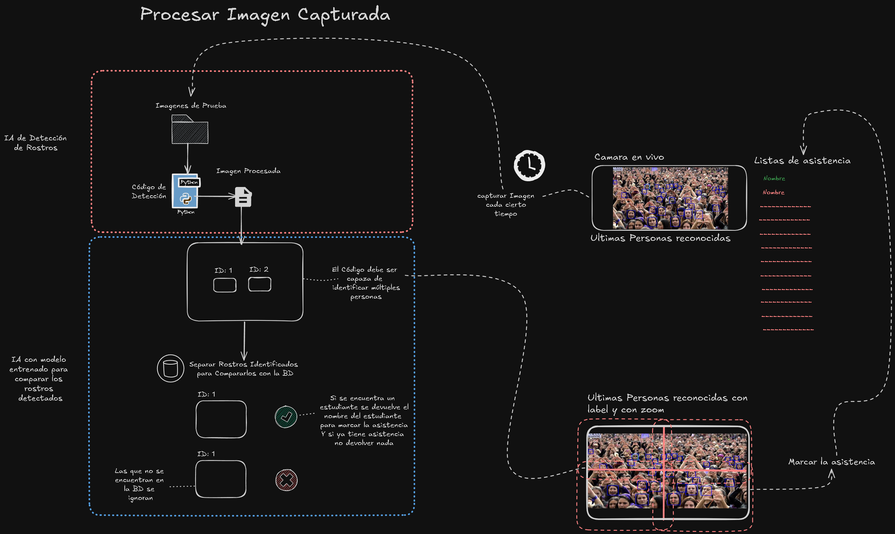

# IA-de-reconocimiento
Proyecto de reconocimiento de estudiantes para asistencia autónoma

# Flujo de Trabajo

# Windows

## Instalar Python
Si estás en Windows, instala la última versión de Python, en nuestro caso la versión de Python 3.12.

## En la terminal, ubicarse en la carpeta donde se tenga almacenado el proyecto
    cd D:\2024\Reconocimiento

## Crear un entorno para realizar las pruebas con Python
    python -m venv myenv

## Si es necesario, brindar los permisos de política para activar el entorno
    Set-ExecutionPolicy -ExecutionPolicy Bypass -Scope Process

## Para activar el entorno
    myenv\Scripts\activate

## Prueba de librería de OpenCV y MediaPipe
    python=3.12.3
    # Instalar las librerías necesarias

    # Para FaceID
    python -m pip install --upgrade pip
    pip install --upgrade opencv-python-headless

    # Para FaceID2
    pip install opencv-python
    pip install --upgrade opencv-contrib-python
    pip install opencv-python mediapipe

    # Para FaceID4
    pip install opencv-python opencv-python-headless numpy

## Prueba de librería DeepFace
    #### Pasos para instalación de dfsd

    Requisitos

    python 3.8

    librerías

    pytorch torchvision torchaudio cudatoolkit opencv

    conda install pytorch torchvision torchaudio cudatoolkit=11.8 -c pytorch  

    conda install conda-forge::opencv

    Instalar el repo

    pip install git+https://github.com/hukkelas/DSFD-Pytorch-Inference.git

    Para correr el programa se necesita el test.py y un directorio llamado images/ con las imagenes a procesar

    Las imagenes procesadas se almacenaran en el mismo directorio

    Para ejecutar test.py

    python3 test.py

## Prueba en jupiter
    #Creacción del entorno
    conda create --name face python=3.10.8

    python -m pip install -U pip
    pip install "numpy<2.0"
    pip install sympy
    pip install pillow
    pip install matplotlib
    pip install opencv-python
    python -m pip install -U matplotlib
    pip install mtcnn
    conda install -c conda-forge notebook
    pip install retina-face

    #Tensorflow 
    conda install -c conda-forge cudatoolkit=11.2 cudnn=8.1.0
    python -m pip install "tensorflow<2.11"

## Si se quiere ejecutar el código para alguna prueba
    (myenv)[ruta actual del proyecto]> python [nombre del ejecutable].py

