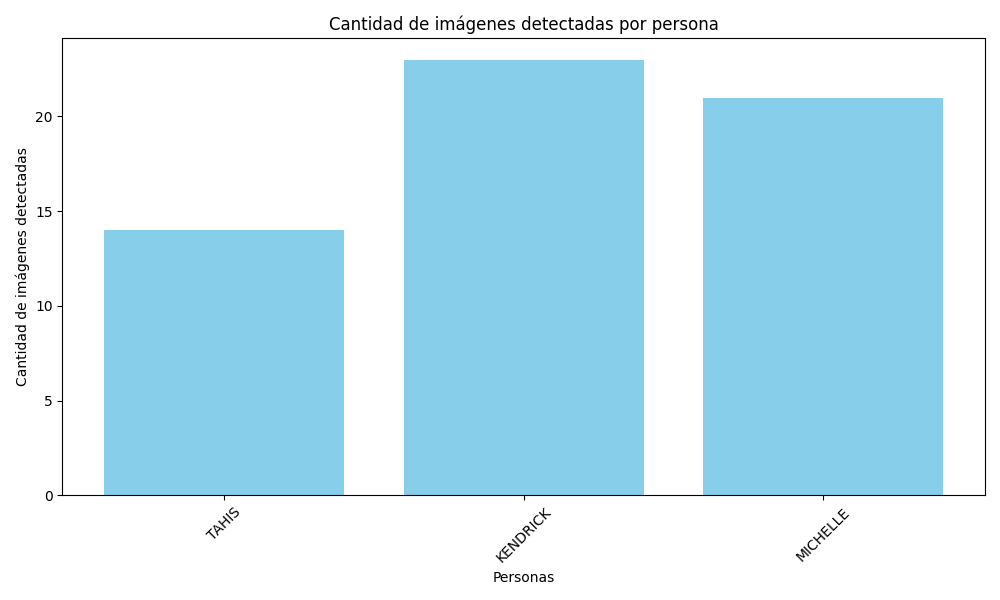

# Análisis del Modelo

Total de clases: 5

Precisión del clasificador: 1.00

Tiempo de carga: 0.02 segundos

Tiempo de entrenamiento: 0.46 segundos

## Precisión por persona
- **KENDRICK**: Precision: 1.00, Recall: 1.00, F1-Score: 1.00
- **MICHELLE**: Precision: 1.00, Recall: 1.00, F1-Score: 1.00
- **TAHIS**: Precision: 1.00, Recall: 1.00, F1-Score: 1.00

## Promedio Macro y Ponderado
**Macro Avg** - Precision: 1.00, Recall: 1.00, F1-Score: 1.00, Support: 5.0
**Weighted Avg** - Precision: 1.00, Recall: 1.00, F1-Score: 1.00, Support: 5.0

## Evaluación del Modelo

El modelo ha demostrado un rendimiento excepcional en la clasificación de las clases evaluadas.

## Análisis de Gráficos

### Gráfico de Personas Detectadas

### Análisis del Clasificador por Clase

## Leyenda de Términos

| Término      | Descripción                                                                                 |
|--------------|--------------------------------------------------------------------------------------------|
| **Precision**    | La proporción de verdaderos positivos sobre el total de positivos predichos.                |
| **Recall**       | La proporción de verdaderos positivos sobre el total de positivos reales.                   |
| **F1-Score**     | La media armónica entre la precisión y el recall, equilibrando ambas métricas.              |
| **Support**      | El número de ocurrencias de cada clase en el conjunto de datos.                             |
| **Macro Avg**    | Promedio simple de precisión, recall y F1-Score para cada clase, sin considerar el soporte. |
| **Weighted Avg** | Promedio ponderado de precisión, recall y F1-Score, considerando el soporte de cada clase.  |
